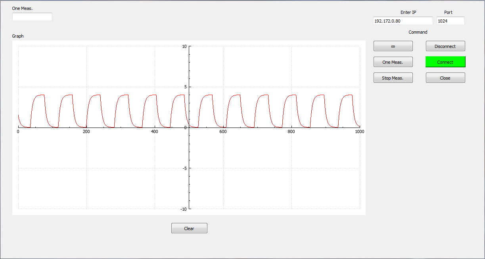
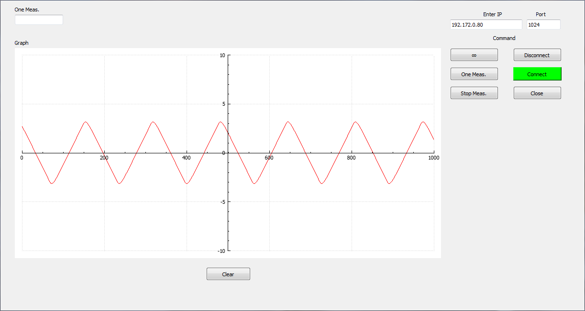
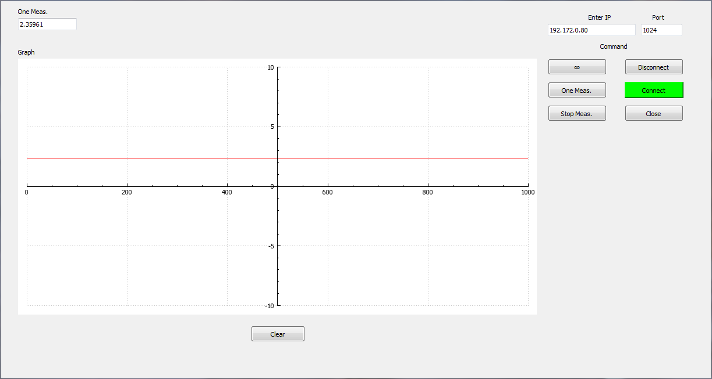

#ZedBoard+AD7606B
__Repository include Qt and Vivado project, which realize next functions:__
__1) Measurement voltage on first channal ADC AD7606B. This part was make on PL part__
__2) Translate result to PS logic across DMA__
__3) Bilding and translate packet on protocol UDP across EMAC. Minimal functions.__
__4) Recived and visualize result in project Qt.__
__Possible make as one-time as continuous measurement.__

###Using Devices:
Board- [ZedBoard](https://reference.digilentinc.com/programmable-logic/zedboard/start?redirect=1)
ADC - [AD7606B](https://www.analog.com/en/products/ad7606b.html)
###Example working:

###Useful links:
[Zynq Ethernet Low Level Driver](https://forums.xilinx.com/t5/Embedded-Development-Tools/Zynq-Ethernet-Low-Level-Driver/td-p/308877) 
[Zynq PS EMAC Ethernet (bare-metal) problem about performance](https://forums.xilinx.com/t5/Processor-System-Design-and-AXI/Zynq-PS-EMAC-Ethernet-bare-metal-problem-about-performance/td-p/673301)
[Zynq-7000 AP SoC Performance – Gigabit Ethernet achieving the best performance](https://xilinx-wiki.atlassian.net/wiki/spaces/A/pages/21430395/Zynq-7000+AP+SoC+Performance+Gigabit+Ethernet+achieving+the+best+performance)
[AD7606B-schematic](https://www.analog.com/media/en/technical-documentation/eval-board-schematic/AD7606B-02-047053-01-g-schematic.pdf)
[AD7606B](https://www.analog.com/media/en/technical-documentation/data-sheets/ad7606_7606-6_7606-4.pdf)